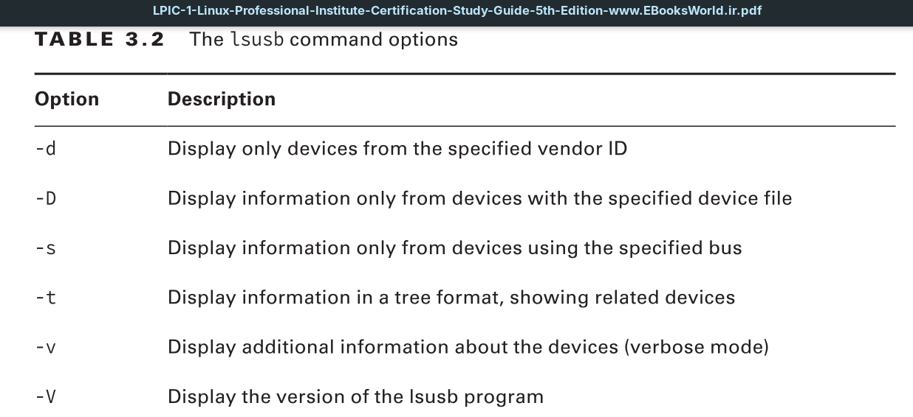
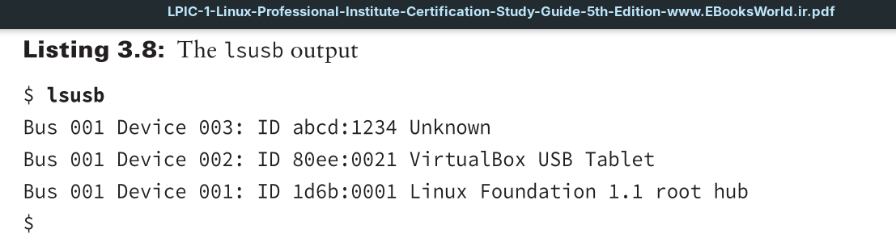

You can view the basic information about USB devices connected to your Linux system by using the `lsusb` command.

Most systems incorporate a standard USB hub for connecting multiple USB devices to the USB controller. Fortunately, there are only a handful of USB hubs on the market, so all Linux distributions include the device drivers necessary to communicate with each of these USB hubs. That guarantees that your Linux system will at least detect when a USB device is connected.

