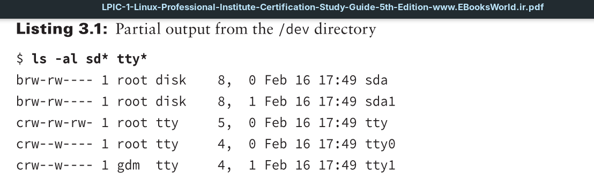

After the Linux kernel communicates with a device on an interface, it must be able to transfer data to and from the device. This is done using device files. Device files are files that the Linux kernel creates in the special `/dev` directory to interface with hardware devices.

To retrieve data from a specific device, a program just needs to read the Linux device file associated with that device. The Linux operating system handles all the unsightliness of interfacing with the actual hardware. Likewise, to send data to the device, the program just needs to write to the Linux device file.

To retrieve data from a specific device, a program just needs to read the Linux device file associated with that device. The Linux operating system handles all the unsightliness of interfacing with the actual hardware. Likewise, to send data to the device, the program just needs to write to the Linux device file.

As you add hardware devices such as USB drives, network cards, or hard drives to your system, Linux creates a file in the `/dev` directory representing that hardware device. Application programs can then interact directly with that file to store and retrieve data on the device. This is a lot easier than requiring each application to know how to directly interact with a device.

There are two types of device files in Linux, based on how Linux transfers data to the device:

- **Character device files:** Transfer data one character at a time. This method is often used for serial devices such as terminals and USB devices.
- **Block device files:** Transfer data in large blocks of data. This method is often used for high-speed data transfer devices such as hard drives and network cards.

The type of device file is denoted by the first letter in the permissions list, as shown in Listing 3.1.

The hard drive devices, sda and sda1, show the letter `b`, indicating that they are block device files. The tty terminal files show the letter `c`, indicating that they are character device files.

Besides device files, Linux also provides a system called the **device mapper**. The device mapper function is performed by the Linux kernel. It maps physical block devices to virtual block devices. These virtual block devices allow the system to intercept the data written to or read from the physical device and perform some type of operation on them. Mapped devices are used by the *Logical Volume Manager* (**LVM**) for creating logical drives and by the Linux Unified Key Setup (**LUKS**) for encrypting data on hard drives when those features are installed on the Linux system.

