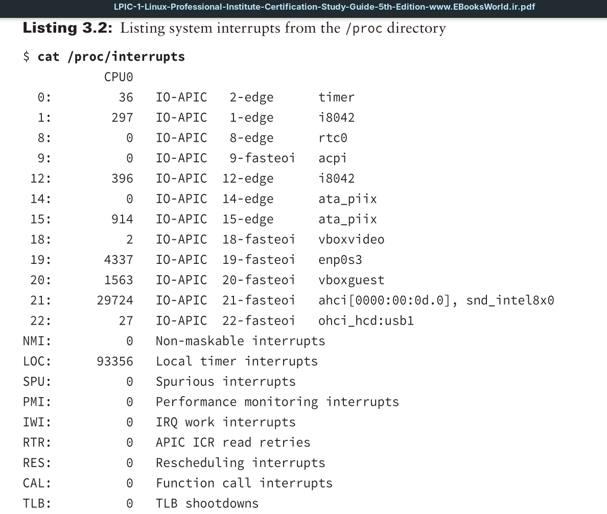
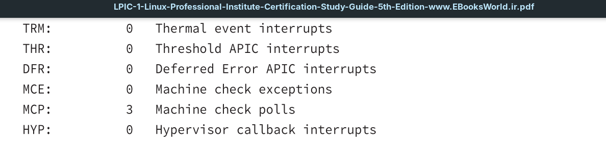
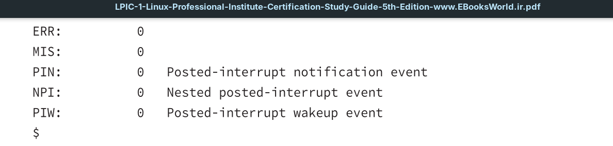
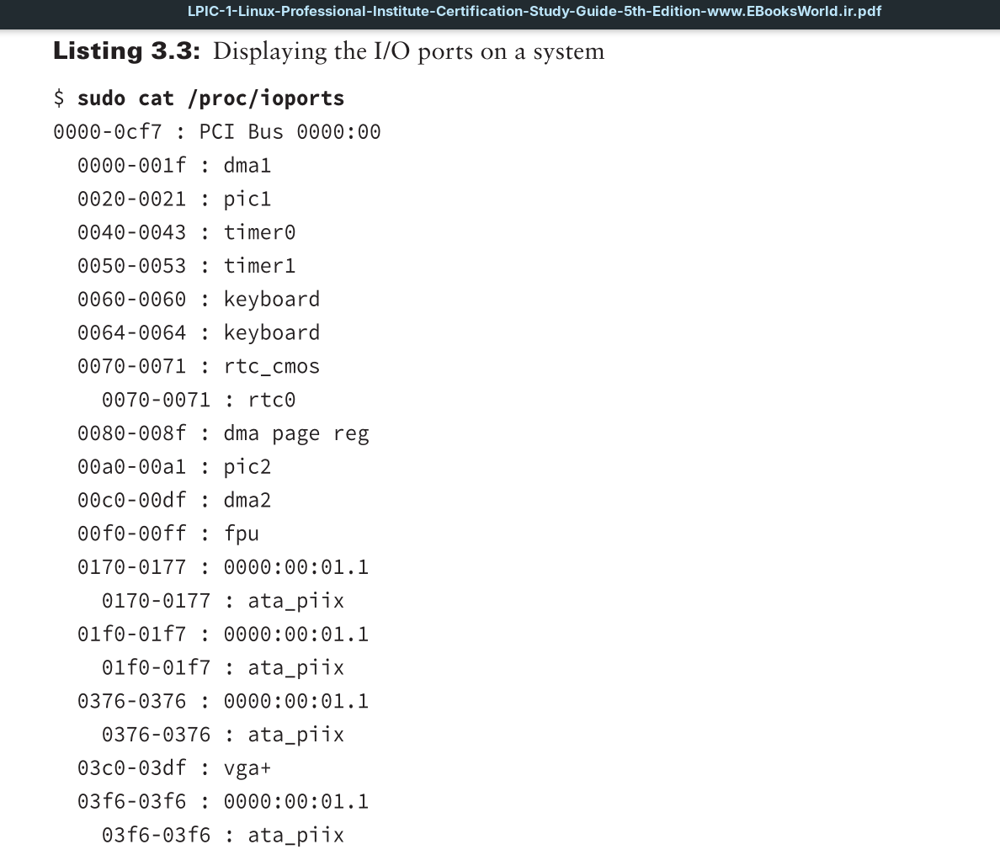
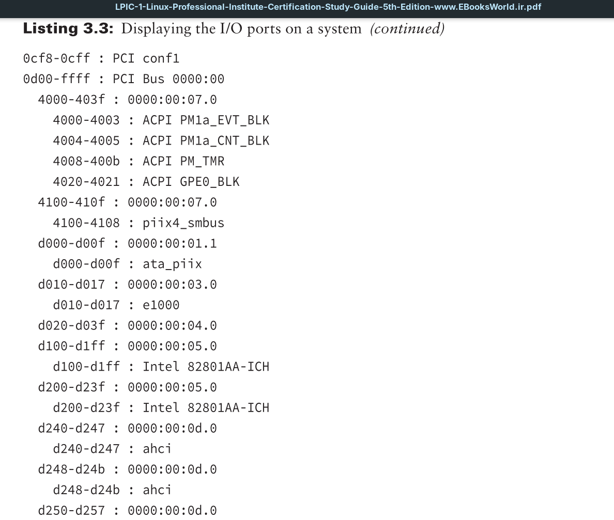
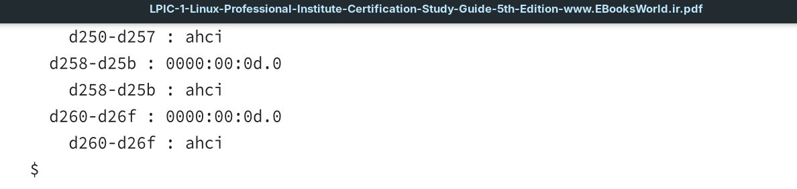
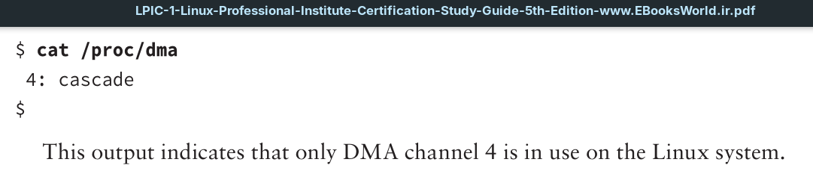

The `/proc` directory is one of the most important tools you can use when troubleshooting hardware issues on a Linux system. It’s not a physical directory on the filesystem, but instead a virtual directory that the kernel dynamically populates to provide access to information about the system hardware settings and status.

>So when you reboot or shutdown your device, this directory will disappear until you boot your device and work with it again.

>`/proc` directory goes to the kernel and searches for specific data you want, and then just shows it and done. The output text isn't stored anywhere — not on disk, not in RAM. But the **source data** it reads from already lives in the kernel's RAM structures.

The Linux kernel changes the files and data in the `/proc` directory as it monitors the status of hardware on the system. To view the status of the hardware devices and settings, you just need to read the contents of the virtual files using standard Linux text commands.

Various `/proc` files are available for different system features, including the *interrupt requests* (**IRQs**), *input/output* (**I/O**) *ports*, and *direct memory access* (**DMA**) channels in use on the system by hardware devices. This section discusses the files used to monitor these features and how you can access them.

## Interrupt Requests
*Interrupt requests* (**IRQs**) allow hardware devices to indicate when they have data to send to the CPU. The PnP system must assign each hardware device installed on the system a unique **IRQ** address. You can view the current **IRQs** in use on your Linux system by looking at the `/proc/interrupts` file using the Linux `cat` command.

Some **IRQs** are reserved by the system for specific hardware devices, such as `0` for the system timer and `1` for the system keyboard. Other **IRQs** are assigned by the system as devices are detected at boot time.

## I/O Ports
The system **I/O ports** are locations in memory where the CPU can send data to and receive data from the hardware device. As with **IRQs**, the system must assign each device a unique **I/O port**. This is yet another feature handled by the PnP system.

You can monitor the **I/O ports** assigned to the hardware devices on your system by looking at the `/proc/ioports` file.

There are lots of different **I/O ports** in use on the Linux system at any time, so your output will most likely differ from this example. With PnP, **I/O port** conflicts aren’t very common, but it is possible that two devices are assigned the same **I/O port**. In that case, you can manually override the settings automatically assigned by using the `setpci` command.

## Direct Memory Access
Using **I/O ports** to send data to the CPU can be somewhat slow. To speed things up, many devices use *direct memory access* (**DMA**) channels. **DMA** channels do what the name implies—they send data from a hardware device directly to memory on the system, without having to wait for the CPU. The CPU can then read those memory locations to access the data when it’s ready.

As with **I/O ports**, each hardware device that uses **DMA** must be assigned a unique channel number. To view the **DMA** channels currently in use on the system, just display the `/proc/dma` file.

