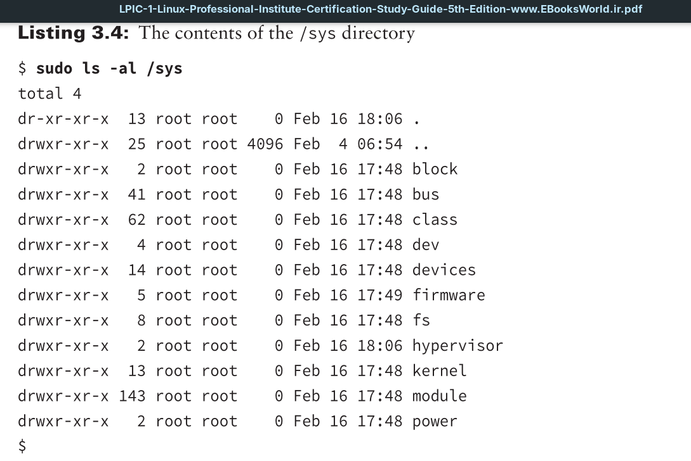

Yet another tool available for working with devices is the `/sys` directory. The `/sys` directory is another virtual directory, similar to the `/proc` directory. It is created by the kernel in the sysfs filesystem format, and it provides additional information about hardware devices that any user on the system can access.

Many different information files are available within the `/sys` directory. They are broken down into subdirectories based on the device and function in the system. You can take a look at the subdirectories and files available within the `/sys` directory on your system using the `ls` command-line command.

Notice the different categories of information that are available. You can obtain information about the system bus, devices, the kernel, and even the kernel modules installed.

