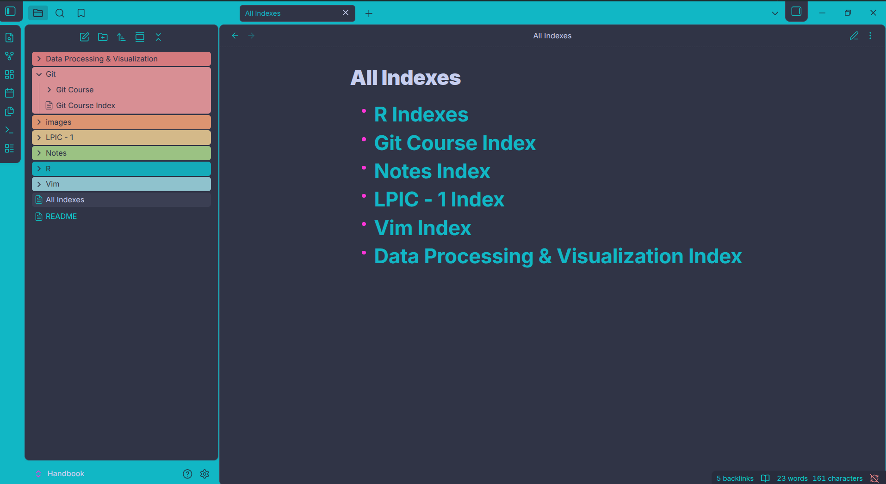
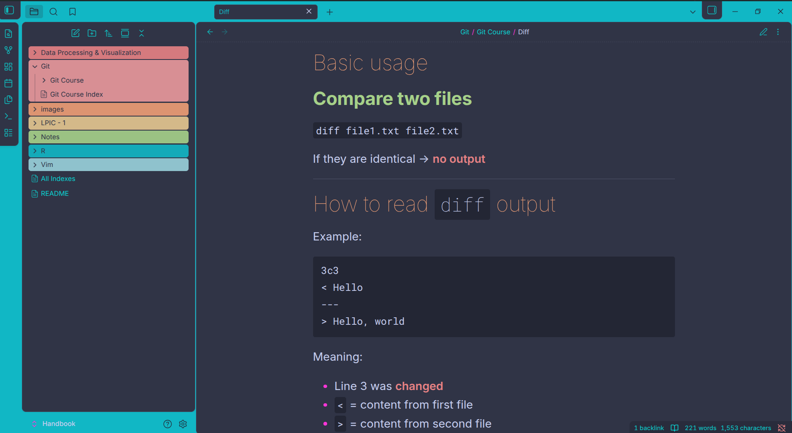

# 📘 Personal Handbook

This is my personal Handbook to understand better subjects.

My main sources for gathering this information are:
- **w3schools**
- **Chat-GPT**
- **Deepseek**
- **YouTube**
- Regular **search**
- Paid courses
- [Maktabkhooneh.org](https://maktabkhooneh.org)
- [Jadi's GitHub](https://github.com/jadijadi)
- Ali Bigdeli
- Jadi Mirmirani
- Farzad Minooie
- **simplilearn** youtube channel

---

## 🖼️ Preview

  


---

## ℹ️ About This Project

This project was built for my own personal need — to keep track of what I've learned and how to store it in a way that I can revisit and review many times later.

I wanted it to be:
- **Fast**
- **Easy**
- **Accessible everywhere**
- **Easily replicable** (so it wouldn’t get lost)

I could have written everything in a physical notebook, but that would have taken way too much time. I would have needed one or maybe several notebooks to carry around everywhere. Also, if I ever wanted to change something later, it would end up messy with crossed-out lines and corrections.

I first started writing notes in plain text files — you can still see them in the old branch. But I don't work on that anymore.

Then I discovered **Obsidian**, and it made my life so much easier. I absolutely love it.

---

## 🎯 What’s the Goal of This Handbook?

It’s **not** meant to turn you into a programmer.

Instead, it aims to make programmers **independent** from constantly searching for basic, essential, or everyday topics we deal with regularly.

**That said, it's not exclusive to programmers either—anyone with curiosity and interest can benefit from it, regardless of background or skill level.**

On the other hand, I started this project as a **living document** of what I’ve learned. I don’t think this project will ever stop as long as I'm alive — unless I get really, really busy.

**Use it and enjoy!** 🚀

---

## 🧭 How to Use

1. Download **Obsidian** from [https://obsidian.md/download](https://obsidian.md/download)
2. Clone this repository on your device.
3. Open the folder/directory in Obsidian.
4. For the best experience, open **`All indexes.md`** — it's like a wiki-link that connects every single file together. You don’t need to open files manually. Just search your topic in the sorted lists.

---

## 🎨 How to Make It Look Like Mine?

1. Open Obsidian and go to **Settings**.
2. Go to **Community plugins** and click **Browse**.  
   *(Note: If this is your first time, click "Turn on community plugins" first.)*
3. Search for **Style settings**, download, and enable it.
4. Go to **Appearance**, click **Manage**, search for **AnuPpuccin** (or any theme you like), install and enable it.
5. Go back to **Community plugins** → **Installed plugins** → click the **Options** icon (gear) next to **Style settings** → **Import**.
6. Paste the following JSON code and enjoy:

```json
{
  "anuppuccin-theme-settings@@anuppuccin-theme-light": "ctp-rosepine-light",
  "anuppuccin-theme-settings@@anuppuccin-theme-dark": "ctp-frappe",
  "anuppuccin-theme-settings@@anuppuccin-light-theme-accents": "ctp-accent-light-teal",
  "anuppuccin-theme-settings@@anuppuccin-theme-accents": "ctp-accent-teal",
  "anuppuccin-theme-settings@@anuppuccin-accent-toggle": true,
  "anuppuccin-theme-settings@@ctp-custom-peach@@light": "#DD7F67",
  "anuppuccin-theme-settings@@ctp-custom-teal@@dark": "#11B7C5",
  "anuppuccin-theme-settings@@ctp-custom-teal@@light": "#1A7DA4",
  "anuppuccin-theme-settings@@ctp-custom-subtext1@@light": "#EE653A",
  "anuppuccin-theme-settings@@ctp-custom-subtext0@@dark": "#FB35D8",
  "anuppuccin-theme-settings@@ctp-custom-subtext0@@light": "#0C9FCE",
  "anuppuccin-theme-settings@@ctp-custom-overlay2@@dark": "#0AD1D0",
  "anuppuccin-theme-settings@@ctp-custom-overlay2@@light": "#525252",
  "anuppuccin-theme-settings@@ctp-custom-overlay1@@dark": "#FFA600",
  "anuppuccin-theme-settings@@ctp-custom-overlay1@@light": "#CCCCCC",
  "anuppuccin-theme-settings@@ctp-custom-overlay0@@dark": "#4CFFD2",
  "anuppuccin-theme-settings@@ctp-custom-overlay0@@light": "#0C9FCE",
  "anuppuccin-theme-settings@@anp-active-line": "anp-no-highlight",
  "anuppuccin-theme-settings@@anp-callout-select": "anp-callout-sleek",
  "anuppuccin-theme-settings@@anp-callout-color-toggle": true,
  "anuppuccin-theme-settings@@anp-custom-checkboxes": true,
  "anuppuccin-theme-settings@@anp-speech-bubble": true,
  "anuppuccin-theme-settings@@tag-radius": 2,
  "anuppuccin-theme-settings@@cards-border-width": "4px",
  "anuppuccin-theme-settings@@anp-color-transition-toggle": true,
  "anuppuccin-theme-settings@@anp-cursor": "pointer",
  "anuppuccin-theme-settings@@anp-toggle-scrollbars": true,
  "anuppuccin-theme-settings@@anp-editor-font-source": "\"\"",
  "anuppuccin-theme-settings@@anp-editor-font-lp": "\"New York\"",
  "anuppuccin-theme-settings@@bold-weight": "700",
  "anuppuccin-theme-settings@@anp-font-live-preview-wt": "400",
  "anuppuccin-theme-settings@@anp-header-color-toggle": true,
  "anuppuccin-theme-settings@@anp-header-divider-color-toggle": true,
  "anuppuccin-theme-settings@@h1-weight": 900,
  "anuppuccin-theme-settings@@h1-line-height": 1.2,
  "anuppuccin-theme-settings@@anp-h1-divider": true,
  "anuppuccin-theme-settings@@h2-size": 1.9,
  "anuppuccin-theme-settings@@h2-weight": 100,
  "anuppuccin-theme-settings@@h3-size": 1.6,
  "anuppuccin-theme-settings@@h3-weight": 700,
  "anuppuccin-theme-settings@@anp-h3-color-custom": "anp-h3-green",
  "anuppuccin-theme-settings@@h4-weight": 700,
  "anuppuccin-theme-settings@@h5-weight": 700,
  "anuppuccin-theme-settings@@h6-size": 1.1,
  "anuppuccin-theme-settings@@h6-weight": 700,
  "anuppuccin-theme-settings@@anp-decoration-toggle": true,
  "anuppuccin-theme-settings@@anp-colorful-frame": true,
  "anuppuccin-theme-settings@@anp-colorful-frame-opacity": 1,
  "anuppuccin-theme-settings@@anp-file-icons": true,
  "anuppuccin-theme-settings@@anp-file-label-align": "0",
  "anuppuccin-theme-settings@@anp-alt-rainbow-style": "anp-full-rainbow-color-toggle",
  "anuppuccin-theme-settings@@anp-rainbow-file-toggle": true,
  "anuppuccin-theme-settings@@anp-rainbow-folder-bg-opacity": 0.9,
  "anuppuccin-theme-settings@@anp-simple-rainbow-title-toggle": true,
  "anuppuccin-theme-settings@@anp-simple-rainbow-indentation-toggle": true,
  "anuppuccin-theme-settings@@anp-stacked-header-width": 30,
  "anuppuccin-theme-settings@@anp-alt-tab-style": "anp-safari-tab-toggle",
  "anuppuccin-theme-settings@@anp-alt-tab-custom-height": 40,
  "anuppuccin-theme-settings@@anp-disable-newtab-align": true,
  "anuppuccin-theme-settings@@anp-depth-tab-opacity": 0.6,
  "anuppuccin-theme-settings@@anp-depth-tab-gap": 10,
  "anuppuccin-theme-settings@@anp-safari-tab-radius": 5,
  "anuppuccin-theme-settings@@anp-safari-tab-gap": 3,
  "anuppuccin-theme-settings@@anp-safari-tab-animated": true,
  "anuppuccin-theme-settings@@anp-layout-select": "anp-card-layout",
  "anuppuccin-theme-settings@@anp-card-radius": 8,
  "anuppuccin-theme-settings@@anp-card-layout-padding": 1,
  "anuppuccin-theme-settings@@anp-card-shadows": true,
  "anuppuccin-theme-settings@@anp-card-layout-actions": true,
  "anuppuccin-theme-settings@@anp-card-layout-filebrowser": true,
  "anuppuccin-theme-settings@@anp-border-radius": 16,
  "anuppuccin-theme-settings@@anp-border-padding": 20
}
```

## 🤝 Contributing

This is a personal project, but feel free to **fork** it and customize it for your own learning journey. If you have suggestions, open an issue or a pull request!

**Enjoy your learning!** ✨