فایل Bash با پسوند `sh.` ذخیره می‌شود. 

برای آنکه کامپیوتر بداند که این فایل یک فایل bash است، در سطر اول آن می‌نویسیم:
```
#!/bin/bash
```

---
#### برای ادامه خوب است ابتدا این را بدانید:
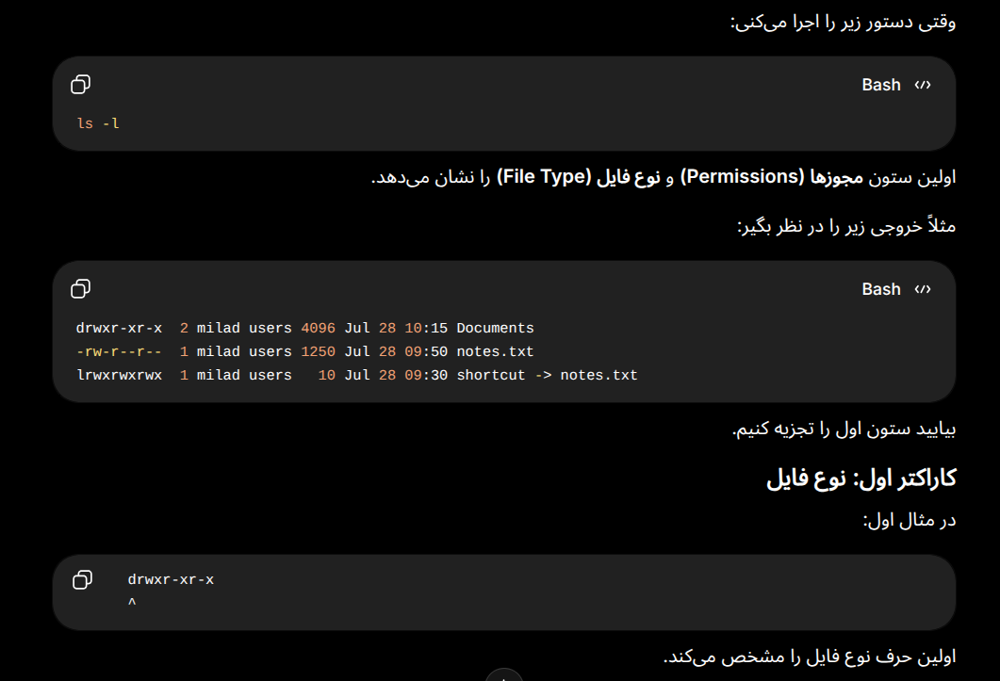

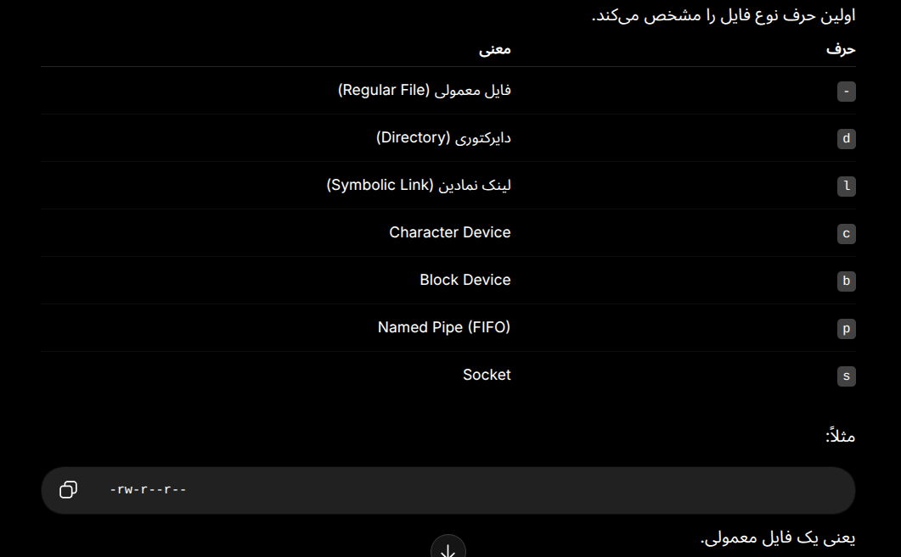

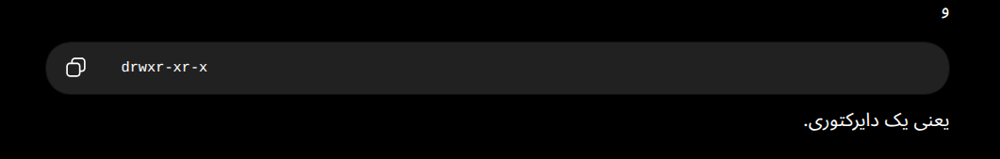

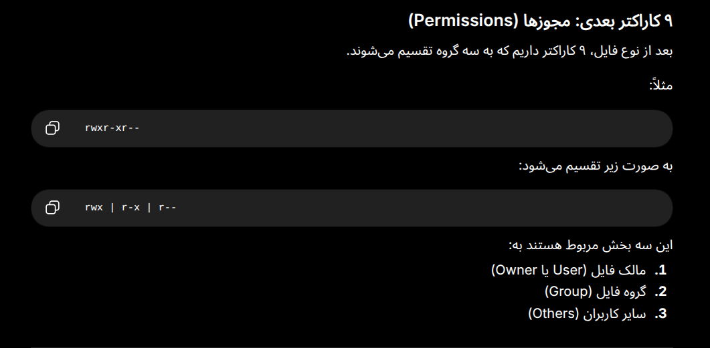


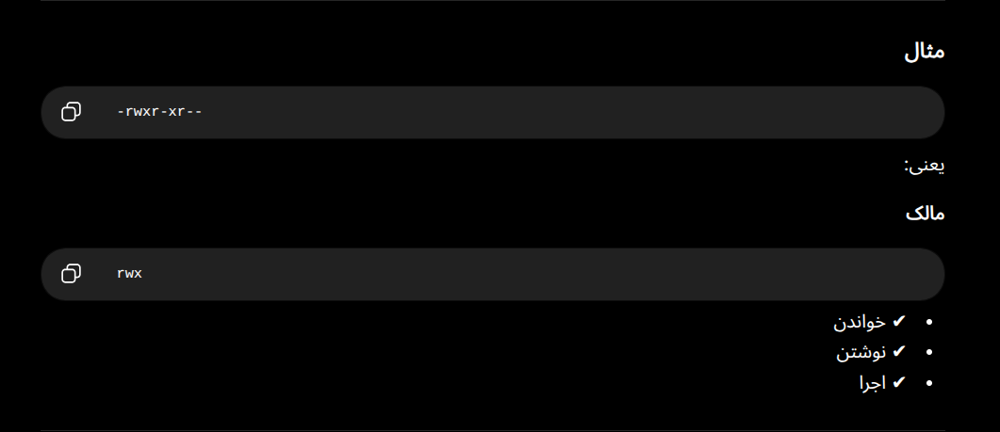

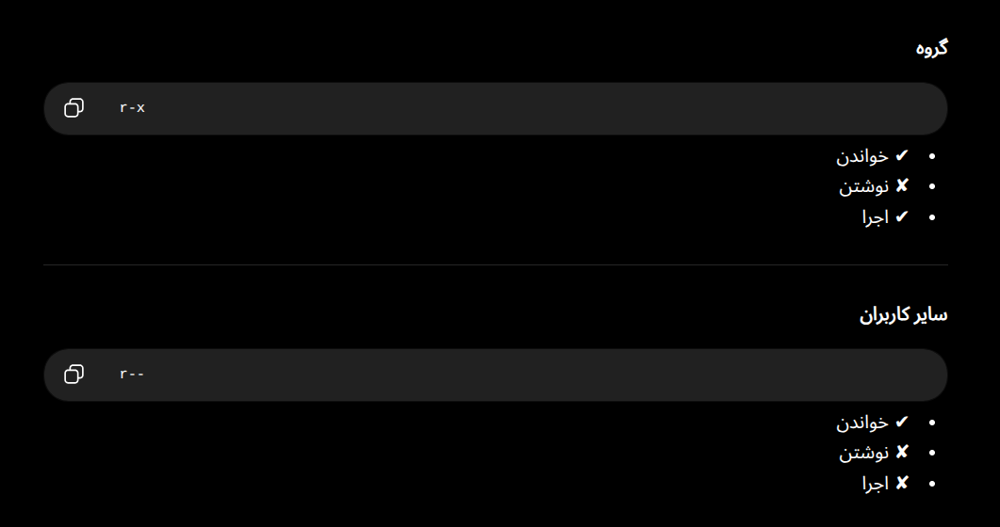

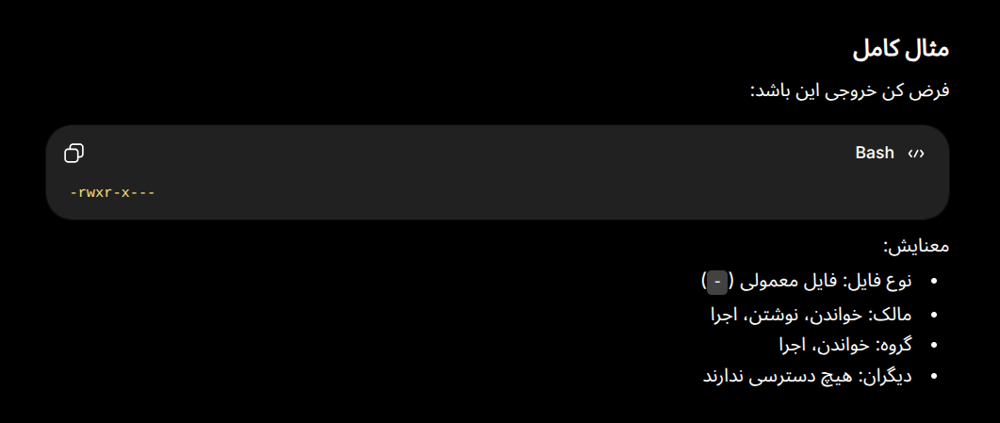

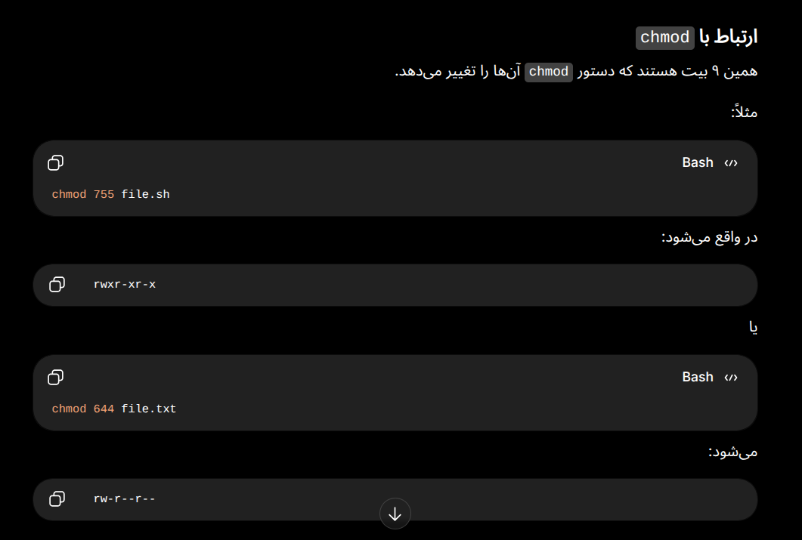

---
برای آنکه فایل bash که ساختیم، مجوز اجرا بدهیم:
```
sudo chmod u+x bash_file.sh
```

برای اجرای یک فایل bash در ترمینال که در مسیر کنونی قرار دارد:
```
./bash_file.sh
```

برای تعریف متغیر در bash script - بدون فاصله باید باشه:
```
variable="Milad"
```

برای استفاده از variable در یک place holder از علامت `$` استفاده می‌کنیم - برای مثال:
```
#!/bin/bash

echo "Welcome Milad"
first_name="Milad"
echo "Hello my dear friend $first_name"
```

در Bash script، سینتکس شرطی آن به صورت زیر است:

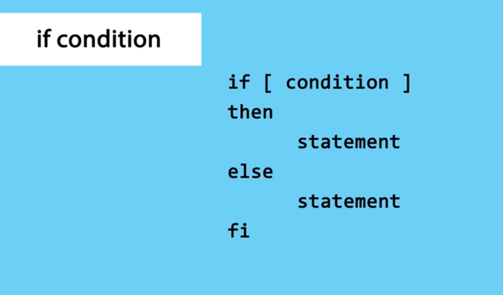

بلوک `then` زمانی که شرط برقرار بود اجرا می‌شود و بلوک `else` زمانی که شرط برقرار نبود اجرا می‌شود. شرط با `fi` که برعکس شده‌ی همان `if` است به پایان می‌رسد.

نکته جالب: مثل پایتون bash هم بلوک `elif` دارد که اگر شرط قبلی برقرار نبود، این یکی اجرا می‌شود. به تعداد مورد نیاز می‌توانیم بلوک `elif` اضافه کنیم. توجه شود که condition مربوط به بلوک `elif` هم مانند `if` باید در `[]` نوشته شود. همچنین مانند بلوک `if` حتما باید دارای `then` هم باشد.

نکته: در ابتدای براکت و انتهای براکت `[]` باید یک فاصله بین شرط وجود داشته باشد تا خطا ندهد.

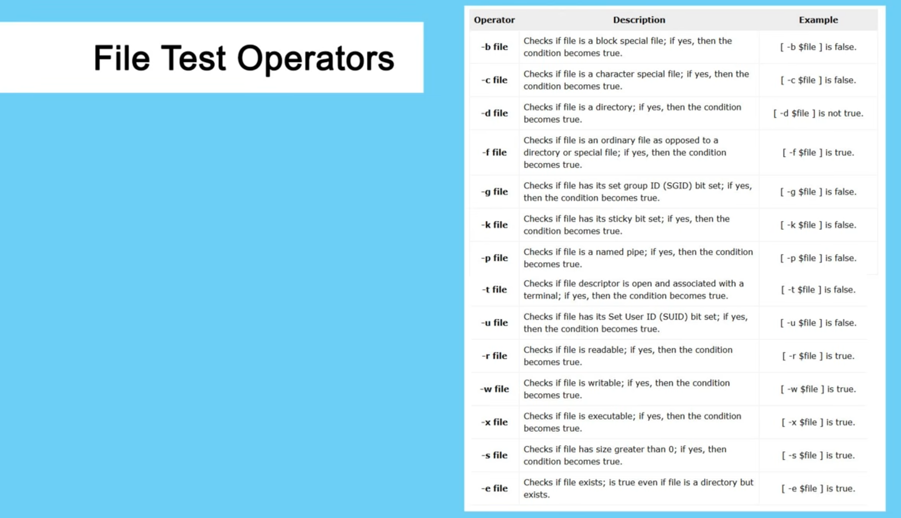

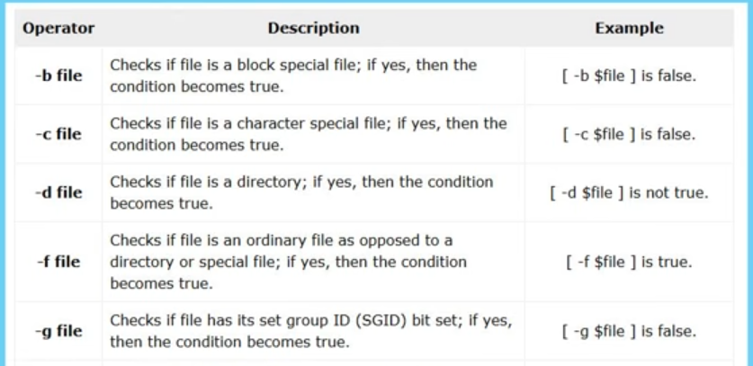

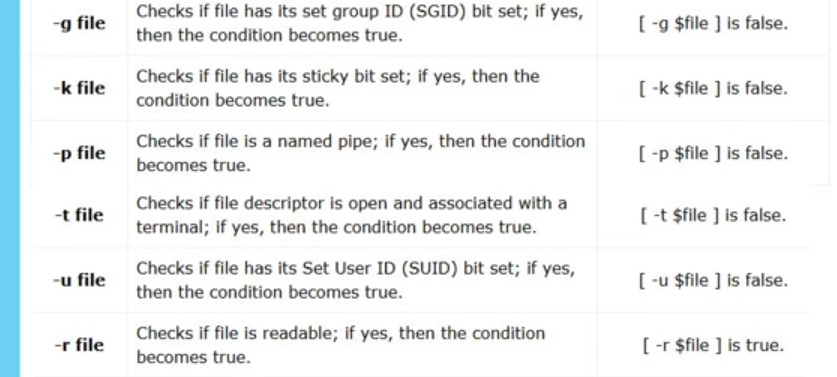

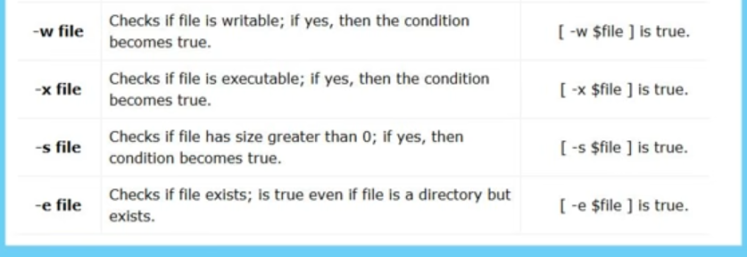

---
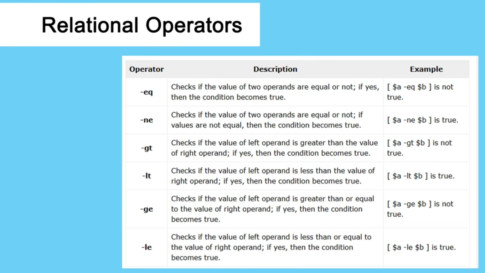

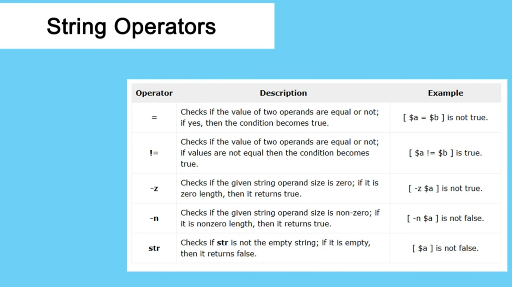

---
برای آنکه bash ما بتواند از کاربر ورودی بگیرد، در اسکریپت آن در مقابل یک متغیر علامت `$` قرار می‌دهیم بعلاوه‌ی ترتیب آن که کاربر در زمانی که به ترتیب ورودی می‌دهد، هر ورودی به کدام متغیر اختصاص یابد.

```
first_name=$1
last_name=$2
```

در زمان اجرا به صورت زیر باید عمل کنیم:

```
./bash_file.sh Milad Salimi
```

اگر ندانیم که تعداد پارامترهای ورودی چه تعداد است، با یک تغییر کوچک در bash script می‌توانیم تعداد را بدست آوریم؛ در bash script می‌نویسیم:

```
$#
```

و برای آنکه نمایش داده شود:

```
echo $#
```

همچنین برای دیدن خودِ پارامتر‌هایی که بعنوان ورودی دادیم، از دستور `*$` استفاده 
می‌کنیم:

```
echo $*
```

برای آنکه در طول اجرای برنامه بتوانیم از کاربر ورودی دریافت کنیم از دستور زیر استفاده می‌کنیم:

```
read -p "something: "
```

در مقابل این خط، کاربر می‌تواند ورودی بدهد.

---
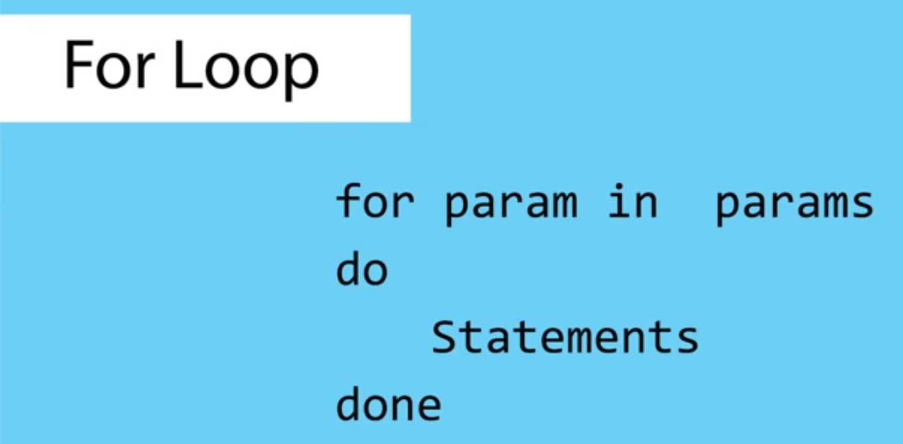

برای آنکه یک range را چاپ کند:
```
#!/bin/bash

for i in {1..10}
do
        echo "$i"
done
```

خوب است ببینی - برای آنکه از دستور `cat` بتوانیم در حلقه استفاده کنیم:
```
#!/bin/bash

for file in $( cat files.txt )
do
        echo "$file"
done
```

---


---
تابع در bash script - برای مثال:
```
#!/bin/bash

greetings()
{
        echo "Hello friend"
}

greetings

echo ":)"
```

