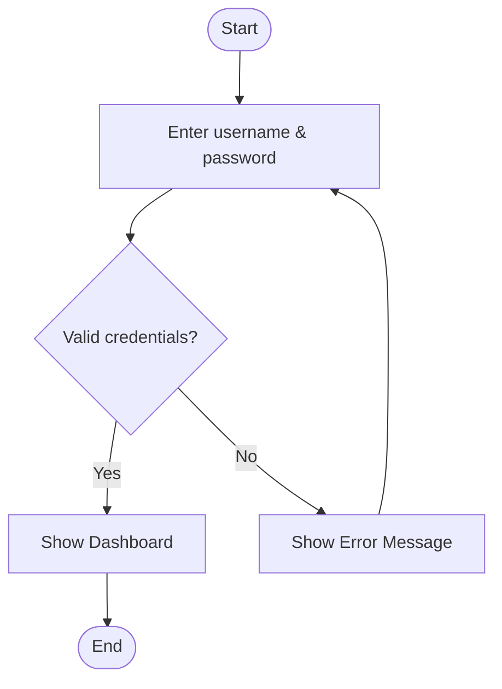
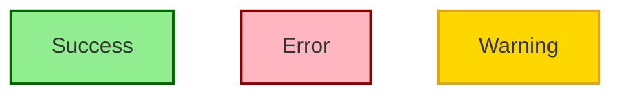
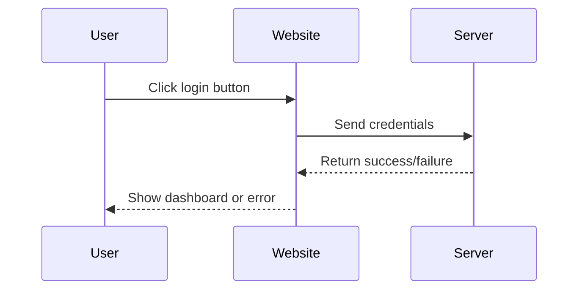
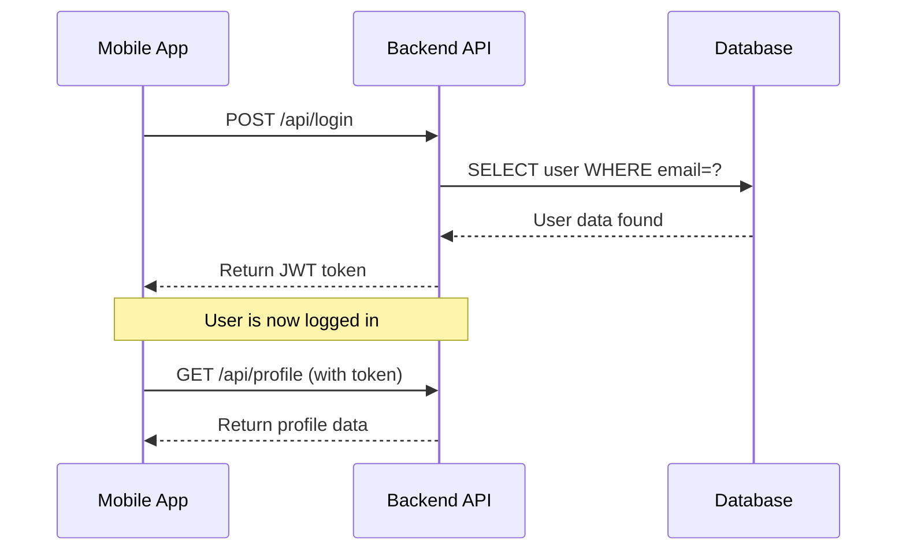
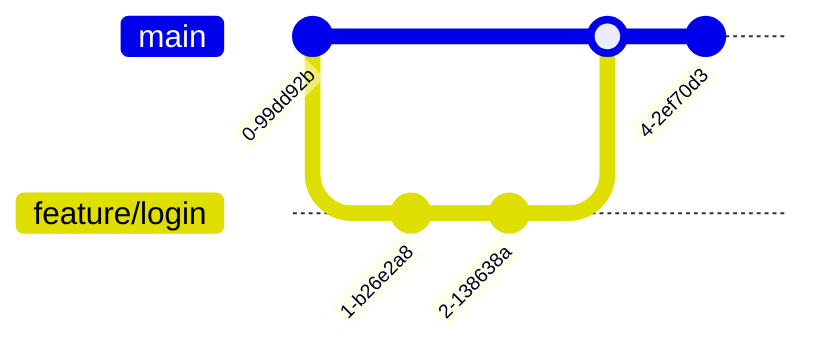

### What is a flowchart?
#### Simple Definition

A **flowchart** is a [[diagram]] that visually represents a process, workflow, or algorithm. It shows the steps as different types of boxes (like rectangles, diamonds, and ovals) and connects them with arrows to show the order or "flow" of the steps.

Think of it as a **roadmap for a process**. Instead of giving a long, written paragraph of instructions, a flowchart shows you the path from start to finish, including all the decisions, actions, and possible outcomes along the way.


### Common Types of Flowcharts

- **Process Flowchart:** Shows a basic business or manufacturing process.
    
- **Workflow Diagram:** Focuses on the tasks and handoffs between different people or departments.
    
- **Data Flow Diagram (DFD):** Focuses on how data moves through a system (used in IT).
    
- **Swimlane Diagram:** A special type of flowchart that groups activities into "lanes" (e.g., Manager lane, Employee lane) to show who is responsible for each step.
    
- **Program Flowchart (or Algorithm Flowchart):** Shows the logic and control flow of a computer program.

---
### 1. What is Mermaid?

**Mermaid** is a **JavaScript-based diagramming and charting tool** that uses **text and code** (inspired by Markdown) to create diagrams.

Instead of dragging and dropping shapes with a mouse, you type a simple, text-based description of the diagram. Mermaid then automatically renders that text into a visual diagram (like a flowchart, sequence diagram, Gantt chart, etc.).

**Key benefits:**

- **Text-based:** Easy to version control (Git), edit, and review (just like code).
    
- **Built into Markdown:** Many platforms support it natively (GitHub, GitLab, Notion, Obsidian, etc.).
    
- **No external apps needed:** You don't need Visio, Lucidchart, or Draw.io.
### 2. Is Mermaid just a VS Code extension?

**No, absolutely not.** Mermaid is an independent, open-source JavaScript library.

It works in many places:

- **On the web:** GitHub, GitLab, Notion, Confluence, Obsidian, Discord (with bots), many documentation sites.
    
- **In documentation tools:** MkDocs, Docusaurus, VuePress, Sphinx.
    
- **In any web page** (by including the Mermaid.js library).
    
- **In VS Code** (via extensions like "Markdown Preview Mermaid Support" or "Mermaid Preview").
    

**In VS Code specifically:** The core VS Code does **not** include Mermaid by default. You need to install an **extension** to see Mermaid diagrams rendered in your Markdown preview. However, Mermaid itself exists completely outside of VS Code.

So: **Mermaid = the technology.** VS Code extension = one of many ways to _use_ that technology.

### 3. What is `flowchart TD` at the top?

`flowchart TD` (or the older alias `graph TD`) is the **first line of Mermaid code** that tells the renderer what kind of diagram to draw and in what direction.

Let's break it down:

|Part|Meaning|
|---|---|
|**`flowchart`**|The type of diagram. (Alternatives: `sequenceDiagram`, `classDiagram`, `gantt`, `stateDiagram`, etc.)|
|**`TD`**|The **direction** or **orientation** of the flowchart. Stands for **Top to Down** (or Top-Down).|

**Common directions for `flowchart`:**

| Code         | Direction (How the chart flows)                  |
| ------------ | ------------------------------------------------ |
| `TD` or `TB` | **Top to Down** (or Top to Bottom) – most common |
| `BT`         | **Bottom to Top**                                |
| `LR`         | **Left to Right**                                |
| `RL`         | **Right to Left**                                |

  
# Complete Guide to Using Mermaid
## 1. Getting Started (Where to Run Mermaid)

You don't need to install anything to start. Here are free options:

| Platform          | How to use                                                                                      |
| ----------------- | ----------------------------------------------------------------------------------------------- |
| **Online Editor** | Go to [mermaid.live](https://mermaid.live/) - type code on left, see diagram on right instantly |
| **GitHub**        | Create a `.md` (Markdown) file and wrap Mermaid code in ` ```mermaid ` blocks \|                |
| **VS Code**       | Install extension "Markdown Preview Mermaid Support", then create `.md` file                    |
| **Notion**        | Type `/mermaid` in any page                                                                     |
| **Obsidian**      | Built-in support - just use ` ```mermaid ` code blocks \|                                       |

## 2. Basic Syntax Rules

Every Mermaid diagram follows this pattern:
```
```mermaid
[DIAGRAM_TYPE] [DIRECTION]
    [STATEMENTS...]
```

**Three golden rules:**

1. Indent with spaces (2 spaces is standard) for readability
    
2. Each statement goes on a new line
    
3. Use `-->` for arrows (connections)

## 3. Flowcharts (Most Common)

### The Nodes (Boxes/Shapes)


```
flowchart TD
    A[Rectangle with text]
    B(Rounded rectangle)
    C{Decision / Diamond}
    D([Stadium shape])
    E[[Subroutine shape]]
    F[(Database)]
    G((Circle))
```

**Syntax:** `ID[Text]` where `ID` is a short name you make up.

### Connecting Nodes

| Syntax        | Meaning          | Example          |
| ------------- | ---------------- | ---------------- |
| `-->`         | Arrow            | `A --> B`        |
| `---`         | Line (no arrow)  | `A --- B`        |
| `-- text -->` | Arrow with label | `A -- Yes --> B` |
| `-.->`        | Dotted arrow     | `A -.-> B`       |
| `==>`         | Thick arrow      | `A ==> B`        |

### Complete Flowchart Example

Let's build a **login system**:
```



### Styling Nodes (Colors)

Add `style` lines at the end:
```



## 4. Sequence Diagrams (For showing interactions over time)

Use these when showing **how different things talk to each other** (e.g., User → Website → Server).

### Basic Structure
```



### Arrow Types in Sequence Diagrams

|Syntax|Meaning|
|---|---|
|`->>`|Solid arrow (request)|
|`-->>`|Dotted arrow (response)|
|`-)`|Async arrow (no waiting)|

### Real Example: API Request
```



---
#### Example: Simple Git Branching Strategy
```




---
## Quick Reference Cheat Sheet

### Flowchart Shapes

|Code|Shape|
|---|---|
|`A[Text]`|Rectangle|
|`B(Text)`|Rounded rectangle|
|`C{Text}`|Diamond (decision)|
|`D([Text])`|Stadium (start/end)|
|`E[[Text]]`|Subroutine|
|`F[(Text)]`|Database|
|`G((Text))`|Circle|

### Diagram Types

|Type|Use for|
|---|---|
|`flowchart`|Processes, algorithms, workflows|
|`sequenceDiagram`|API calls, user interactions|
|`classDiagram`|Object-oriented programming|
|`stateDiagram`|State machines, status changes|
|`erDiagram`|Database relationships|
|`gantt`|Project schedules|
|`gitGraph`|Git branching|

### Directions

|Code|Meaning|
|---|---|
|`TD` or `TB`|Top to Bottom|
|`BT`|Bottom to Top|
|`LR`|Left to Right|
|`RL`|Right to Left|

---
## Pro Tips

1. **Use meaningful IDs** - `LoginScreen` is better than `A`
    
2. **Add spaces for readability** - Mermaid ignores extra whitespace
    
3. **Test often** - Refresh preview after each few lines
    
4. **Copy examples first** - Modify working code rather than starting from scratch
    
5. **Use `%%` for comments** - Helps you remember what each part does
    

**The best way to learn:** Open [mermaid.live](https://mermaid.live/) and modify the examples above. Change colors, add nodes, break things intentionally to see what happens!