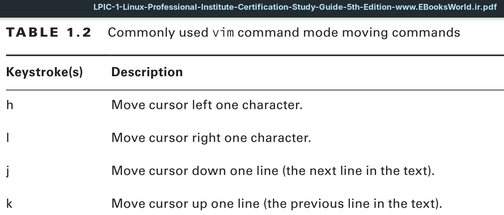
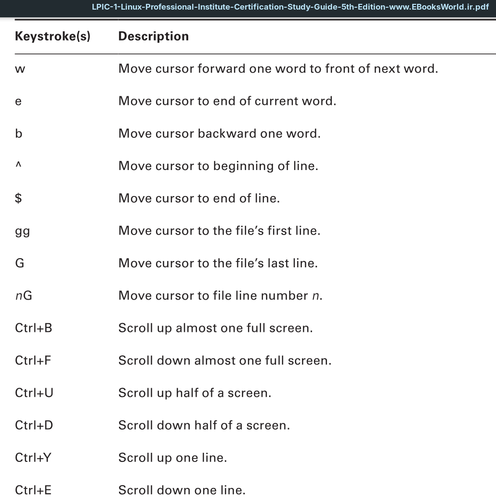
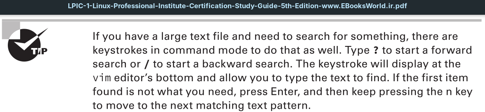
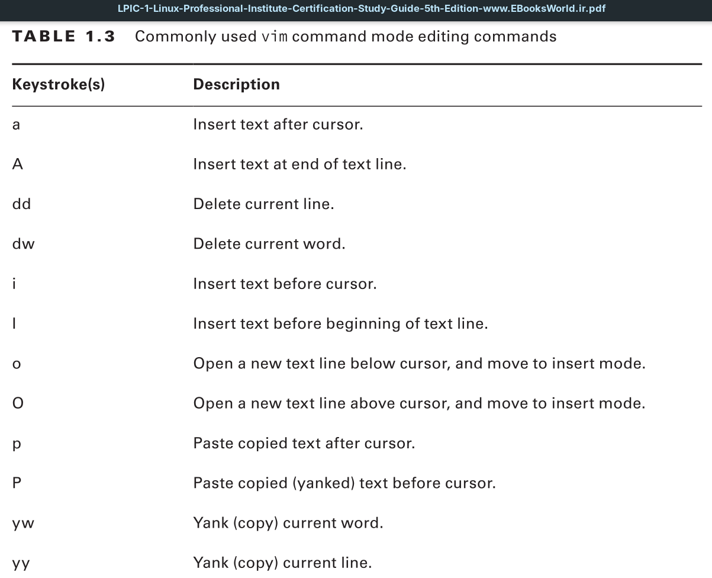
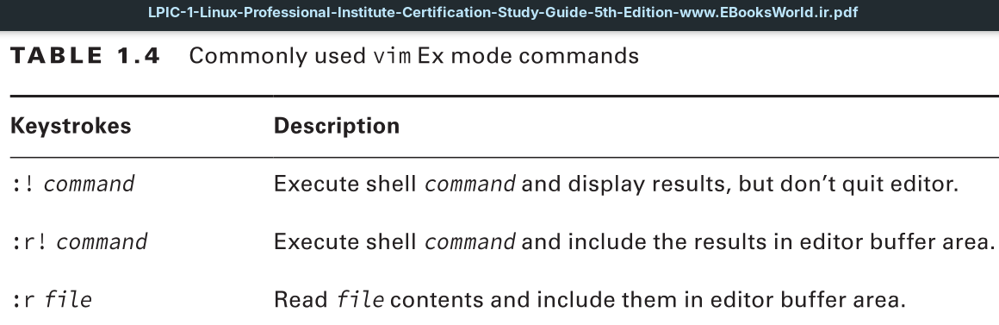
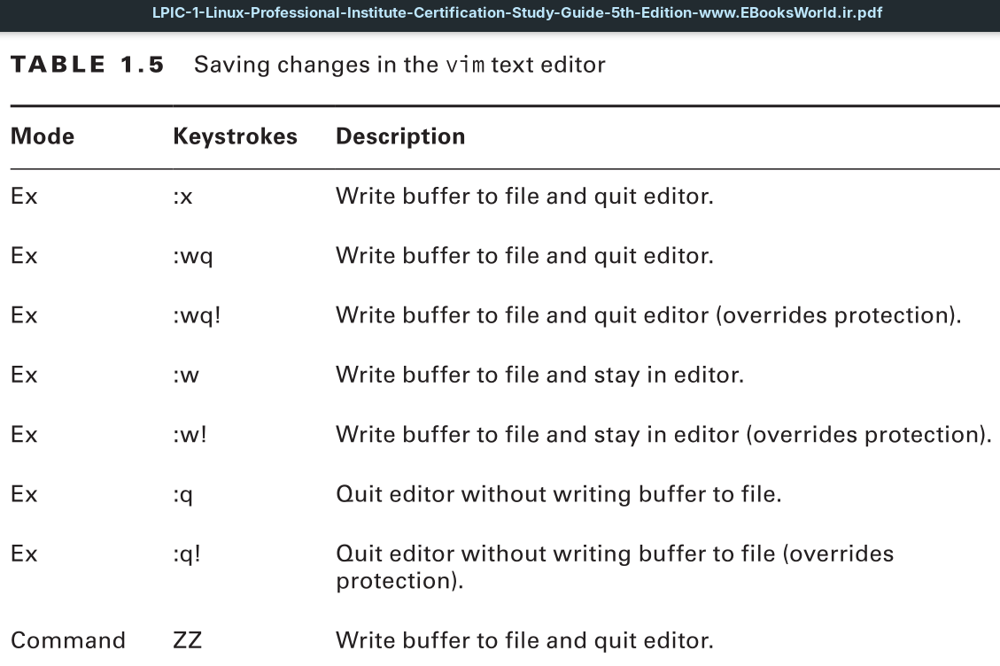
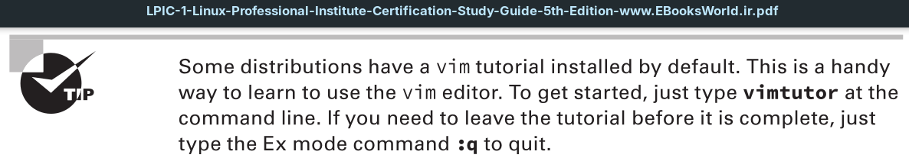

Before we take a look at using the vim editor, we need to talk about vim versus vi. The vi editor was a Unix text editor, and when it was rewritten as an open source tool, it was improved. Thus, vim stands for “vi improved.”

Often you’ll find the vi command will start the vim editor. In other distributions, only the vim command will start the vim editor. Sometimes both commands work.

---
## Understanding vim Modes
The vim editor has three standard modes as follows:

**Command Mode:** This is the mode vim uses when you first enter the buffer area; it is sometimes called *normal mode*. Here you enter keystrokes to enact commands. For example, pressing the `J` key will move your cursor down one line. Command is the best mode to use for quickly moving around the buffer area.

**Insert Mode:** Insert mode is also called *edit or entry mode*. This is the mode where you can perform simple editing. There are not many commands or special mode keystrokes.
You enter this mode from command mode by pressing the `I` key. At this point, the message `--Insert--` will display in the message area. You leave this mode by pressing the `Esc` key.

**Ex Mode:** This mode is sometimes also called `colon commands` because every command entered here is preceded with a colon (`:`). For example, to leave the vim editor and not save any changes you type `:q` and press the `Enter` key.

## Exploring Basic Text-Editing Procedures









In command mode, you can take the editing commands a step further by using their full syntax, which is as follows:
```
COMMAND [NUMBER-OF-TIMES] ITEM
```

For example, if you wanted to delete three words, you would press the `d`, `3`, and `w` keys.
If you wanted to copy (yank) the text from the cursor to the end of the text line, you would press the `y $` keys, move to the location you desired to paste the text, and press the `P` key.



## Saving Changes
After you have made any needed text changes in the vim buffer area, it’s time to save your work. You can use one of many methods as shown in Table 1.5. Type `ZZ` in command mode to write the buffer to disk and exit your process from the vim editor.



---

