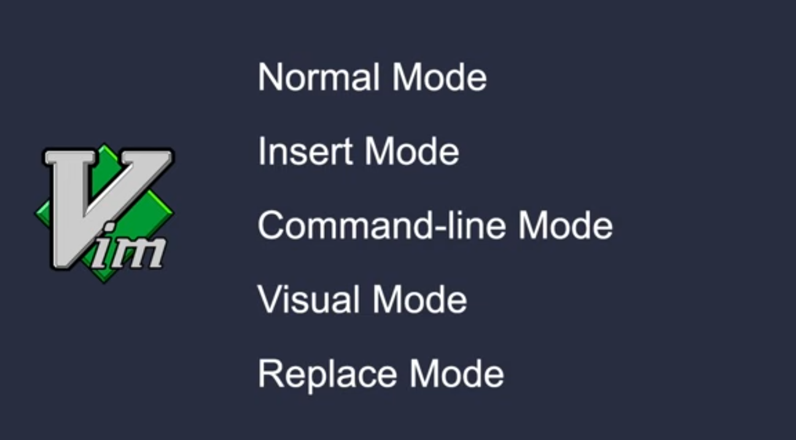

As you entered to the vim, the first mode is `normal mode`. 

>To active `insert mode` just press `i`. Now you can write.

>Press `esc` to get back to `normal mode`.

#### Command-line mode:
To save changes, need to get back to `normal mode`. Then use `:` to active `command-line mode`. To save changes after entered `command-line mode`: 
```
:w
```
Changes will be saved.

To quit from vim:
```
:q
```

To save and quit:
```
:wq
```

To quit without saving:
```
:q!
```

To copy:
```
ctrl + Lshift + c
```

To paste:
```
ctrl + Lshift + v
```

To set number for better visualisation:
```
:set numbers
```

To go to an specific row - For example row 7:
```
:7
```

>Combine those two code above for better result.

To replace first found word with new word:
```
:%s/old_word/replace_new_word
```

To replace all math word with new word:
```
:%s/word/replace_new_word/g
```

To run command:
```
:! something
```

#### Insert mode:
To active `insert mode` from `normal mode`:
- Press `i` - Normally active `insert mode`
- Press `a` - One character forward then go to `insert mode`
- Press `o` - New paragraph bellow, then go to `insert mode`
- Press `O` - New paragraph above, then go to `insert mode`

#### Actions in `normal mode`:

Alternative arrows:
- `H` - Left
- `J` - Down
- `K` - Up
- `L` - Right


To copy a row - Press double `y` rapidly:
```
yy
```

To paste copied row - Press `p`.

To delete a row - Press double `d` rapidly:
```
dd
```

To delete next characters - Press `x`.

To undo - Just press `u`.

#### Visual mode:
>To active `visual mode` press `v` - To copy character by character.
>To copy row by row (before activating `visual mode`) press `V` to enter `visual mode` that can select row by row.

Now with `arrows` you can select.

To copy selected, press `y`.
To paste copied, press `p`.

To delete selected character(s) or row(s), press `d`.

#### Replace mode:
Press `R` to activate `replace mode`.
In `replace mode` whatever you write will be replaced automatically.